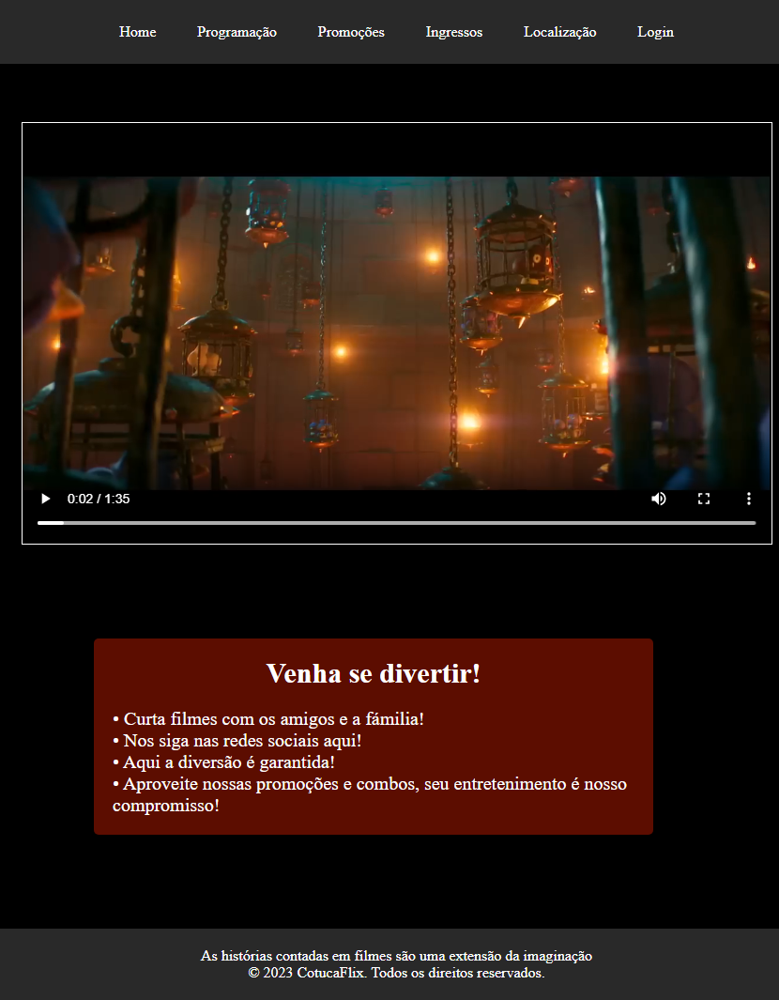

# 📌 Cine Page
> Cine Page is a simple interactive project to display information about movies and cinema sessions. The website is developed using HTML, CSS and animations to provide a dynamic and engaging user experience.
---
| *Cine Page* - [🔗 Here](https://endrewsk.github.io/Cine-Page/) |



### 📖 Index
- [📌 Project Name](#-cine-page)
- [🚀 Features](#-features)
- [📦 Technologies Used](#-technologies-used)
- [⚙️ Installation](#️-installation)
- [▶️ How to Use](#️-how-to-use)
- [📄 Project Structure](#-project-structure)
- [🤝 Contribution](#-contribution)
- [📝 License](#-license)

---

### 🚀 Features
✔️ **Feature 1** – Home Page

✔️ **Feature 2** – Location

✔️ **Feature 3** – Login

✔️ **Feature 4** – Scheduling

✔️ **Feature 5** – Promotions

✔️ **Feature 6** – Tickets

---

### 📦 Technologies used
The project was developed using the following technologies:
- 🎨 **Front-end** – HTML and CSS

---
### ⚙️ Installation
### Requirements:
Before starting, make sure you have installed:
- An up-to-date browser (Google Chrome, Firefox, Edge, etc.)

### Installation steps:
- Download project [Here](https://github.com/EndrewSK/Cine-Page/archive/refs/heads/main.zip)
```sh
# Clone the repository via command prompt (cmd)
git clone https://github.com/EndrewSK/Cine-Page.git

# Enter the project folder through Windows Explorer

# Enter the home folder

# And double click on home.html to open in browser
```

---

### ▶️ How to use
1️⃣ Step 1: Open the home folder and home.html file in your browser.

2️⃣ Step 2: Explore the sections:
- Home
- Localization
- Login
- Schedule
- Promotions
- Tickets

NOTE: The home path is ../ because of the github pages, to test locally, change it to the .html path

3️⃣ Step 3: Enjoy the interactive experience with smooth animations and design!

---

### 📄 Project structure
```bash
📦 project-name
│-- 📂 assets/ # Images of the project
│
│-- 📄 index.html # Main HTML file for the home section
│-- 📄 style.css # Styles for the home section
│
│-- 📂 localization/ # Localization section of the project
│ │-- 📄 localization.html # Main HTML file for localization
│ │-- 📄 style.css # Styles for the localization section
│
│-- 📂 login/ # Login section of the project
│ │-- 📄 login.html # Main HTML file for login
│ │-- 📄 style.css # Styles for the login section
│
│-- 📂 schedule/ # Schedule section of the project
│ │-- 📄 schedule.html # Main HTML file for the schedule
│ │-- 📄 style.css # Styles for the schedule section
│
│-- 📂 promotions/ # Promotions section of the project
│ │-- 📄 promotions.html # Main HTML file for promotions
│ │-- 📄 style.css # Styles for the promotions section
│
│-- 📂 tickets/ # Tickets section of the project
│ │-- 📄 tickets.html # Main HTML file for tickets
│ │-- 📄 style.css # Styles for the tickets section
│
│-- 📄 README.md # Main documentation for the project

```

---

### 🤝 Contribution
Contributions are welcome! To contribute:
1. **Fork** this repository.
2. Create a **branch** (`git checkout -b my-feature`). 3. Make your changes and **commit** (`git commit -m 'My new feature'`).
3. Push to the remote repository (`git push origin my-feature`).
4. Create a **Pull Request** and wait for review.

---

### 📝 License
This project is licensed under the **MIT** license - see the [LICENSE](LICENSE) file for more details.

---

📌 **Developed by [Endrew](https://github.com/endrewsk)**
